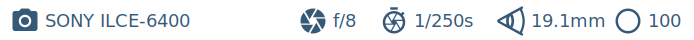

# metaframer

Metaframer is a tool to generate `.svg` frames for images from their metadata to be displayed alongside images in videos or other scenarios.

- Displays metadata information such as focal length, camera model, shutter speed, ISO and aperture
- Configurable (background, font, size, templates, target display resolution)
- Able to batch process multiple images at once (like with any other CLI tool)

## Preview

`metaframer *.jpg` will attempt to generate an `.svg` frame for all files that match `*.jpg`.

## Installation

For the first release I've only made it possible to install `metaframer` through `cargo install metaframer`

## Possible roadmap

- [ ] Custom templates
- [ ] Font scaling in case of lack of space

## Development

For now I will only make fixes for my own use cases and scenarios.
Feel free to open an [Issue](https://github.com/michalvankodev/metaframer/issues/new) for a proposal or idea for implementation.
Feel free to open a Pull Request with improvements or bug fixes or items that are on the roadmap.

